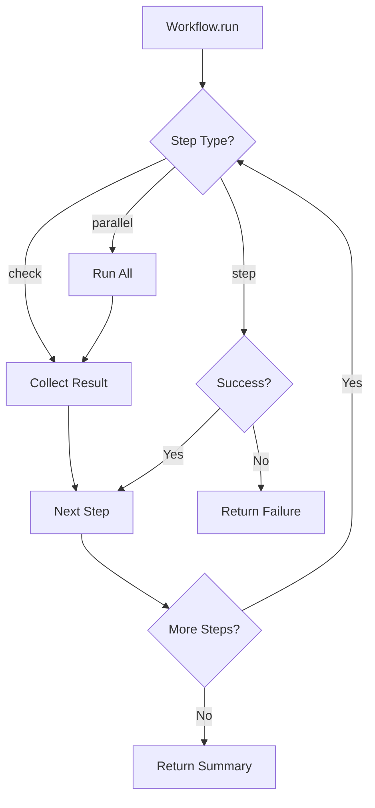

# relkit Architecture

## Overview

relkit is an opinionated project manager for modern Python projects that enforces strict conventions while providing a clean, testable architecture. This document describes the core patterns and design decisions.

## Core Design Principles

1. **Explicit over Implicit** - Clear workflows, no hidden magic
2. **Separation of Concerns** - Release management separate from dependency management
3. **Testable** - Return data structures, not side effects
4. **Workspace-Aware** - Unified handling of single and multi-package projects
5. **Fail Fast** - Validate early, provide actionable error messages

## Architectural Patterns

### 1. Command Decorator Pattern

Commands use decorators for validation and safety:

```python
@command("bump", "Bump version and update changelog")
@requires_review("commits", ["relkit git log"], ttl=600)
@requires_clean_git
def bump(ctx: Context, bump_type: str = "patch", package: Optional[str] = None) -> Output:
    # Decorators handle pre-conditions
    # Function contains only business logic
    return Output(success=True, message="Bumped version")
```

The decorators provide:
- Git state validation
- Review token generation
- Safety checks
- Consistent error handling

### 2. Output Pattern (Data Layer)

All commands return structured `Output` objects instead of printing:

```python
@dataclass
class Output:
    success: bool
    message: str
    data: Optional[Dict[str, Any]] = None        # Structured data for chaining/testing
    details: Optional[List[Dict[str, Any]]] = None # Additional info with type hints
    next_steps: Optional[List[str]] = None # Guide user to next action
```

Benefits:
- Testable without capturing stdout
- Chainable commands
- Consistent user experience
- Machine-readable results

### 3. Workflow Pattern (Orchestration Layer)

Complex multi-step operations use a builder pattern:

```python
workflow = (Workflow("release")
    .check(check_clean_working_tree)     # Can fail without stopping
    .check(check_version_entry)      
    .parallel(                   # Run simultaneously
        check_formatting,
        check_linting,
        check_types
    )
    .step(build_package)         # Must succeed to continue
    .step(test_package)
    .step(publish)
    .run(ctx, package=package))
```

Workflow types:
- `.check()` - Validation that collects all failures
- `.step()` - Critical step that stops on failure  
- `.parallel()` - Independent operations run together

### 4. Workspace Context Pattern

The `WorkspaceContext` unifies single and workspace projects:

```python
@dataclass
class Package:
    name: str
    version: str
    path: Path
    is_root: bool = False

@dataclass
class WorkspaceContext:
    root: Path
    has_workspace: bool
    packages: Dict[str, Package]
    
    def require_package(self, name: Optional[str]) -> Package:
        """Get package or fail with helpful error"""
        ...
```

Context features:
- Auto-detects project type (single/workspace/hybrid)
- Package-specific operations
- Backward compatible via alias

## File Structure

```
src/relkit/
├── __init__.py           # Package version
├── __main__.py           # Entry point
├── cli.py                # Display logic
├── decorators.py         # @command decorator
├── models.py             # Output class, Context alias
├── workspace.py          # Package, WorkspaceContext
├── workflows.py          # Workflow builder
├── safety.py             # Safety decorators
├── utils.py              # Tool runners (git, uv, ruff)
├── commands/
│   ├── bump.py           # Version bumping
│   ├── status.py         # Project status
│   ├── build.py          # Package building
│   ├── publish.py        # PyPI publishing
│   ├── release.py        # Full workflow
│   ├── check.py          # Quality checks
│   └── ...
└── checks/
    ├── git.py            # Git state checks
    ├── changelog.py      # Changelog validation
    ├── quality.py        # Format, lint, types
    └── ...
```

## Command Flow

```mermaid
graph LR
    CLI[CLI Input] --> Decorator[@command]
    Decorator --> Validate[Auto-Validation]
    Validate --> Command[Command Function]
    Command --> Output[Output Object]
    Output --> Display[CLI Display]
```

## Workflow Execution



## Testing Strategy

### Unit Tests
```python
def test_bump_version():
    ctx = WorkspaceContext.from_path(test_fixture)
    result = bump(ctx, "patch", package="mypackage")
    
    assert result.success
    assert result.data["new"] == "0.1.1"
    assert "changelog" in result.details[0].lower()
```

### Integration Tests
```python
def test_release_workflow():
    ctx = TestContext.from_fixture("sample_project")
    workflow = create_release_workflow()
    result = workflow.run(ctx)
    
    assert result.success
    assert Path("dist/sample-0.1.0.whl").exists()
```

### No Stdout Capture Needed
Since all commands return `Output` objects, tests check return values directly rather than capturing print statements.

## Error Handling

### Validation Errors
- Caught by decorators before command runs
- Return Output with clear message and available options

### Check Failures  
- Collected and reported together
- User sees all issues at once, not one at a time

### Step Failures
- Stop workflow immediately
- Show what completed and what failed
- Provide recovery instructions

### Example Error Output
```
✗ 3 check(s) failed
  Git working directory: 5 uncommitted changes
  Changelog entry: No [0.1.0] section found
  Code formatting: 2 files need formatting

Next steps:
  1. Run: git status
  2. Update CHANGELOG.md with [0.1.0] section
  3. Run: relkit format
```

## Extension Points

### Adding New Commands
1. Create function in appropriate `commands/` module
2. Add `@command` decorator
3. Return `Output` object
4. Register in `COMMANDS` dict

### Adding New Checks
1. Create function returning `Output` 
2. Add to appropriate workflow
3. Checks are independent and composable

### Adding New Workflows
1. Create `Workflow()` instance
2. Chain steps/checks as needed
3. Workflows can include other workflows as steps

## Best Practices

### DO
- Return `Output` objects from all commands
- Use `@command` decorator for all CLI commands
- Keep commands focused on single responsibility
- Use workflows for multi-step operations
- Write tests against return values, not stdout

### DON'T
- Print directly in command functions
- Repeat workspace validation logic
- Mix business logic with display logic
- Create deeply nested command calls
- Mutate Context during execution

## Workspace Support

Relkit handles three project types seamlessly:

1. **Single Package** - Traditional project with one pyproject.toml
2. **Pure Workspace** - Multiple packages, no root package
3. **Hybrid Workspace** - Root package plus workspace members

Package operations in workspaces require explicit `--package` selection:
```bash
relkit bump patch --package termtap
relkit build --package termtap
```

Tags are automatically formatted:
- Single/Root packages: `v1.0.0`
- Workspace members: `package-v1.0.0`

Each phase can be done incrementally without breaking existing functionality.

## Performance Considerations

- Context is loaded once and reused
- Parallel checks run simultaneously  
- Git operations are cached where possible
- File I/O is minimized through batching

## Security Considerations

- Never auto-commit without user confirmation
- Public package publishing requires explicit confirmation
- Git credentials never stored or logged
- PyPI tokens handled by uv, not by this tool

## Future Enhancements

Possible additions that fit the architecture:

- Plugin system via entry points
- Workflow visualization (mermaid/graphviz)
- Dry-run mode for all commands
- JSON output mode for automation
- Watch mode for continuous validation
- Distributed workflows for monorepos