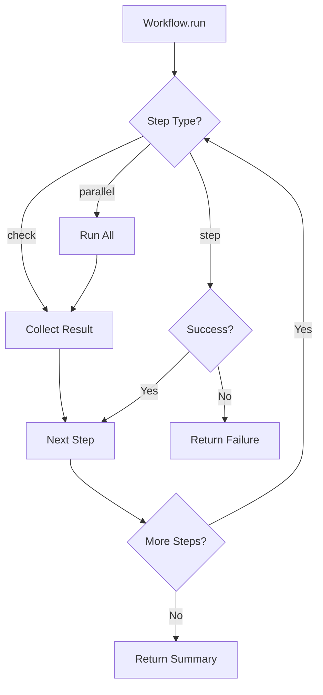

# relkit Architecture

## Overview

relkit is an opinionated project manager for modern Python projects that enforces strict conventions while providing a clean, testable architecture. This document describes the core patterns and design decisions.

## Core Design Principles

1. **Explicit over Implicit** - Clear workflows, no hidden magic
2. **Composable** - Small functions that combine into complex workflows
3. **Testable** - Return data structures, not side effects
4. **Consistent** - Same patterns everywhere
5. **Fail Fast** - Validate early, clear error messages

## Architectural Patterns

### 1. Mini-Typer Pattern (Command Layer)

All CLI commands use a decorator pattern that eliminates boilerplate:

```python
@command("bump", "Bump version number", requires_package=True)
def bump_version(ctx: Context, bump_type: str, package: Optional[str] = None) -> Output:
    # No workspace validation needed - decorator handles it
    # No print statements - return Output object
    # Actual logic only
```

The decorator automatically:
- Validates workspace requirements
- Checks package flags
- Handles common error cases
- Provides consistent help text

### 2. Output Pattern (Data Layer)

All commands return structured `Output` objects instead of printing:

```python
@dataclass
class Output:
    success: bool
    message: str
    data: dict = None        # Structured data for chaining/testing
    details: List[str] = None # Additional info
    next_steps: List[str] = None # Guide user to next action
```

Benefits:
- Testable without capturing stdout
- Chainable commands
- Consistent user experience
- Machine-readable results

### 3. Workflow Pattern (Orchestration Layer)

Complex multi-step operations use a builder pattern:

```python
workflow = (Workflow("release")
    .check(check_git_clean)     # Can fail without stopping
    .check(check_changelog)      
    .parallel(                   # Run simultaneously
        check_formatting,
        check_linting,
        check_types
    )
    .step(build_package)         # Must succeed to continue
    .step(test_package)
    .step(publish)
    .run(ctx, package=package))
```

Workflow types:
- `.check()` - Validation that collects all failures
- `.step()` - Critical step that stops on failure  
- `.parallel()` - Independent operations run together

### 4. Context Pattern (State Management)

The `Context` object encapsulates all project state:

```python
class Context:
    type: str  # 'single', 'workspace', 'hybrid'
    name: str
    version: str
    packages: List[str]
    package_types: Dict[str, str]  # package -> 'tool'|'library'
    
    # Computed properties
    @property
    def is_public(self) -> bool
    @property
    def last_tag(self) -> Optional[str]
    @property
    def commits_since_tag(self) -> int
```

Context is:
- Read from pyproject.toml once
- Passed through all functions
- Never mutated (stateless operations)

## File Structure

```
src/relkit/
├── __init__.py
├── __main__.py           # Entry point
├── cli.py                # CLI runner, display logic
├── decorators.py         # @command decorator, validation
├── models.py             # Output, Context dataclasses
├── workflows.py          # Workflow builder, orchestration
├── commands/
│   ├── __init__.py
│   ├── versioning.py     # bump, version commands
│   ├── release.py        # build, test, publish, tag
│   ├── quality.py        # format, lint, check
│   └── changelog.py      # init-changelog, update
└── checks/
    ├── __init__.py
    ├── git.py            # Git status checks
    ├── quality.py        # Format, lint, type checks
    └── release.py        # Version, changelog, tag checks
```

## Command Flow

```mermaid
graph LR
    CLI[CLI Input] --> Decorator[@command]
    Decorator --> Validate[Auto-Validation]
    Validate --> Command[Command Function]
    Command --> Output[Output Object]
    Output --> Display[CLI Display]
```

## Workflow Execution



## Testing Strategy

### Unit Tests
```python
def test_bump_version():
    ctx = MockContext(version="0.1.0")
    result = bump_version(ctx, "patch")
    
    assert result.success
    assert result.data["new"] == "0.1.1"
    assert "changelog" in result.details[0].lower()
```

### Integration Tests
```python
def test_release_workflow():
    ctx = TestContext.from_fixture("sample_project")
    workflow = create_release_workflow()
    result = workflow.run(ctx)
    
    assert result.success
    assert Path("dist/sample-0.1.0.whl").exists()
```

### No Stdout Capture Needed
Since all commands return `Output` objects, tests check return values directly rather than capturing print statements.

## Error Handling

### Validation Errors
- Caught by decorators before command runs
- Return Output with clear message and available options

### Check Failures  
- Collected and reported together
- User sees all issues at once, not one at a time

### Step Failures
- Stop workflow immediately
- Show what completed and what failed
- Provide recovery instructions

### Example Error Output
```
✗ 3 check(s) failed
  Git working directory: 5 uncommitted changes
  Changelog entry: No [0.1.0] section found
  Code formatting: 2 files need formatting

Next steps:
  1. Run: git status
  2. Update CHANGELOG.md with [0.1.0] section
  3. Run: relkit format
```

## Extension Points

### Adding New Commands
1. Create function in appropriate `commands/` module
2. Add `@command` decorator
3. Return `Output` object
4. Register in `COMMANDS` dict

### Adding New Checks
1. Create function returning `Output` 
2. Add to appropriate workflow
3. Checks are independent and composable

### Adding New Workflows
1. Create `Workflow()` instance
2. Chain steps/checks as needed
3. Workflows can include other workflows as steps

## Best Practices

### DO
- Return `Output` objects from all commands
- Use `@command` decorator for all CLI commands
- Keep commands focused on single responsibility
- Use workflows for multi-step operations
- Write tests against return values, not stdout

### DON'T
- Print directly in command functions
- Repeat workspace validation logic
- Mix business logic with display logic
- Create deeply nested command calls
- Mutate Context during execution

## Migration Path

To migrate existing code:

1. **Phase 1**: Add Output class, update one command
2. **Phase 2**: Add @command decorator, update validation
3. **Phase 3**: Extract workflows from complex commands
4. **Phase 4**: Move all display logic to CLI layer
5. **Phase 5**: Add comprehensive tests

Each phase can be done incrementally without breaking existing functionality.

## Performance Considerations

- Context is loaded once and reused
- Parallel checks run simultaneously  
- Git operations are cached where possible
- File I/O is minimized through batching

## Security Considerations

- Never auto-commit without user confirmation
- Public package publishing requires explicit confirmation
- Git credentials never stored or logged
- PyPI tokens handled by uv, not by this tool

## Future Enhancements

Possible additions that fit the architecture:

- Plugin system via entry points
- Workflow visualization (mermaid/graphviz)
- Dry-run mode for all commands
- JSON output mode for automation
- Watch mode for continuous validation
- Distributed workflows for monorepos